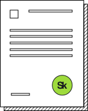

##Документом, подтверждающим статус участника проекта является Выписка из реестра участников.

Как получить Выписку из реестра

Направьте запрос на предоставление выписки из личного кабинета участника lk.sk.ru.
Для этого войдите в раздел "Процессы участника", выберите соответствующую компанию и тип выписки.

Внимание! Если в личном кабинете раздел "Процессы участника" недоступен или Вы не можете выбрать свою организацию, следует обратиться в службу техподдержки sitehelp@sk.ru и запросить соответствующий доступ для учетной записи, под которой Вы входите в личный кабинет на сайте lk.sk.ru.

Выписка из реестра участников может быть предоставлена с электронно-цифровой подписью. Этого документа достаточно, чтобы подтвердить право участника на использование налоговых льгот

Регламентный срок подготовки и направления выписки - 10 дней.